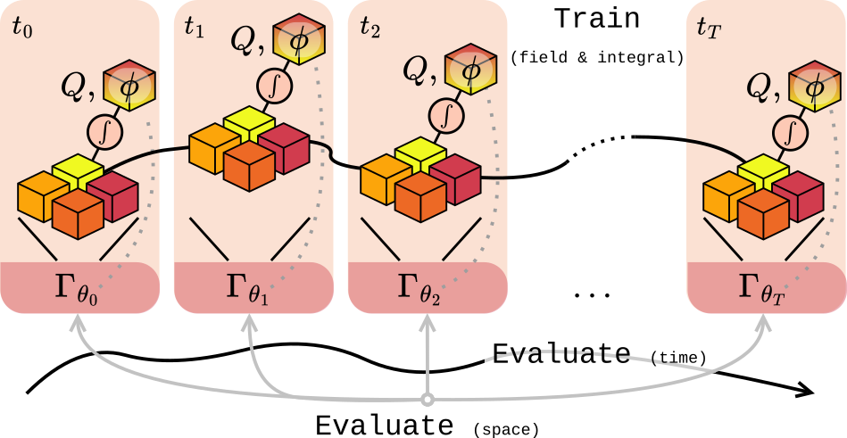

# Neural Gyrokinetics
Machine learning tools to accelerate high-dimensional plasma turbulence simulations.
Neural Gyrokinetics includes research code for
-  <strong>[GyroSwin](https://arxiv.org/abs/2510.07314)</strong>, a 5D neural surrogate for nonlinear gyrokinetics.
-  <strong>[PINC](TODO)</strong>, physics-informed neural compression for plasma data.

## Who is this for?
For researchers at the intersection between scientific machine learning and plasma physics, or in general working on (accelerating) high-dimensional simulations.

## Pretrained GyroSwin Models

Our trained Gyroswin models are available on the huggingface hub. We provide all three model sizes of GyroSwin as reported in the paper: [Small](https://huggingface.co/ml-jku/gyroswin_small) | [Medium](https://huggingface.co/ml-jku/gyroswin_medium) | [Large](https://huggingface.co/ml-jku/gyroswin_large).

In addition we uploaded the different in-distribution and out-of-distribution cases we used for evaluation in the paper on the huggingface hub at [this link](https://huggingface.co/datasets/ml-jku/gyroswin_cbc_id_ood).
The uploaded data contains the snapshot which we start from for the different simulations along with all necessary conditioning parameters. 
To perform inference with a GyroSwin model, simply execute

```
python -m neugk.gyroswin.eval.inference_from_hf
```
  
This script will automatically fetch all necessary data from the hub along with the model weights and perform inference in an autoregressive manner. Each prediction (df, phi, flux) will be stored in a newly generated directory called `predictions`. You can select which model checkpoint to load via the `--ckpt` option.

## Data Generation
The dataset used to train GyroSwin is too large to be easily distributed,
but we include instructions on how to generate it as well as the configuration files needed in the `data_generation` directory. 


## Running
Running is managed with Hydra configs, structured as follows.

```
📁 configs
├── 📁 dataset                     # Dataset configs (specify paths and trajectories here)
├── 📁 logging                     # Logging configs
├── 📁 model                       # Configs for GyroSwin and baselines
├── 📁 training                    # Training configs
└── 📁 validation                  # Validation configs
```

After generating and preprocessing the dataset, GyroSwin and baselines training can be started with `main.py`.

##  GyroSwin
<p align="center">
  
</p>
GyroSwin is a 5D vision transformer trained to capture the full nonlinear dynamics of gyrokinetic plasma turbulence. It uses shifted window linear attention, as global attention is too expensive for 5-dimensional grids.
GyroSwin provides accurate predictions of turbulent transport at a fraction of the computational cost, while preserving key physical phenomena missed by tabular regression or quasilinear models.

Check out our [blogpost](https://ml-jku.github.io/blog/2025/gyroswin/)!


##  Physics-Informed Neural Compression of Plasma Data
<p align="center">
  
</p>

__Physics-Inspired Neural Compression (PINC)__ investigates compression of (storage intensve) gyrokinetic plasma turbulence data by up to 70,000× while preserving key physical characteristics. It also proposes a unified evaluation pipeline to assess how well different compression techniques retain spatial and temporal turbulence phenomena.

PINC is presented in our second [blogpost](https://ml-jku.github.io/blog/2025/pinc/).


## Project structure
```
📁 data_generation                    # Info for generating gyrokinetics data from GKW

📁 configs                            # Experiment configs

📁 neugk
├── 📁 gyroswin                       # Code from the GyroSwin paper
│   ├── 📁 eval                       # Evaluation and analysis
│   │   ├── 📄 evaluate.py            # Rollout evaluation functions
│   │   ├── 📄 inference_from_hf.py   # Inference utilities
│   │   ├── 📄 inference.py           # Inference utilities
│   │   ├── 📄 postprocess.py         # Postprocessing of outputs
│   │   └── 📄 rollout.py             # Rollout evaluation script
│   ├── 📁 models                     # Model architectures
│   │   ├── 📄 fno.py                 # Fourier Neural Operator baseline
│   │   ├── 📄 gyroswin.py            # Multi-head GyroSwin
│   │   ├── 📄 pointnet.py            # PointNet baseline
│   │   ├── 📄 transformer.py         # Transformer baseline
│   │   ├── 📄 transolver.py          # Transolver baseline
│   │   ├── 📄 vit_flat.py            # Vision Transformer baseline
│   │   └── 📄 x_layers.py            # Cross attention mixing blocks
│   └── 📄 run.py                     # Gyroswin runner (train, log and eval)
│
├── 📁 pinc                           # Code from physics-inspired compression
│   ├── 📁 autoencoders               # 5D swin autoencoder and VQ-VAE
│   │   ├── 📄 ae_utils.py            # Loading and autoencoder training
│   │   ├── 📄 evaluate.py            # Autoencoder evaluation functions
│   │   ├── 📄 gk_autoencoder.py      # 5D AE, VAE and VQ-VAE models
│   │   ├── 📄 vapor.py               # VAPOR baseline (by Choi et al., 2021)
│   │   └── 📄 vector_quantize.py     # Vector quantization logic
│   ├── 📁 neural_fields              # Neural fields models, training and evaluation
│   │   ├── 📁 models                 # MLP, SIREN and WIRE
│   │   ├── 📄 data.py                # Simple in-memory dataset and dataloader
│   │   ├── 📄 gk_losses.py           # Gyrokinetic physics-informed losses
│   │   ├── 📄 nf_train.py            # Neural field training
│   │   ├── 📄 nf_utils.py            # Neural field utilities, evaluation and plotting
│   │   └── 📄 trad.py                # Traditional compression funcions
│   ├── 📄 losses.py                  # Extended PINC-specific balancer
│   ├── 📄 nf_main.py                 # Neural fields staggered runner and grid search
│   ├── 📄 peft_utils.py              # LoRA utilities for PINC training of large models
│   └── 📄 run.py                     # PINC autoencoder runner
|
├── 📁 dataset                        # Dataset utilities and preprocessing
│   ├── 📄 augment.py                 # Data augmentation functions
│   ├── 📄 cyclone.py                 # Gyrokinetics dataset class
│   ├── 📄 cyclone_diff.py            # Autoencoder-specific dataset
│   └── 📄 preprocess.py              # Preprocessing utilities
│
├── 📁 models                         # Model architectures
│   ├── 📁 nd_vit                     # nD Vision Transformer modules
│   │   ├── 📄 drop.py                # Dropout and regularization
│   │   ├── 📄 patching.py            # Patching utilities
│   │   ├── 📄 positional.py          # Positional encodings
│   │   ├── 📄 swin_layers.py         # Swin Transformer layers
│   │   └── 📄 vit_layers.py          # ViT layers
│   ├── 📄 gk_unet.py                 # UNet swin model
│   └── 📄 layers.py                  # Common layers (MLP, attention, conditioning)
|
├── 📄 eval.py                    # General evaluation and base class
├── 📄 integrals.py               # Gyrokinetics integrals (potential and flux)
├── 📄 losses.py                  # Loss computation and gradient balancer
├── 📄 plot_utils.py              # Basic visualizations and disgnostics
├── 📄 runner.py                  # Base runner class
└── 📄 utils.py                   # General helper stuff

📄 main.py                        # Entry point for training/experiments
```

## Citing

```
@inproceedings{paischer2025gyroswin,
    title={GyroSwin: 5D Surrogates for Gyrokinetic Plasma Turbulence Simulations}, 
    author={Fabian Paischer and Gianluca Galletti and William Hornsby and Paul Setinek and Lorenzo Zanisi and Naomi Carey and Stanislas Pamela and Johannes Brandstetter},
    booktitle={Advances in Neural Information Processing Systems 38: Annual Conference on Neural Information Processing Systems 2025, NeurIPS 2025, San Diego, CA, USA, December 02 - 07, 2025},
    year={2025}
}
```
