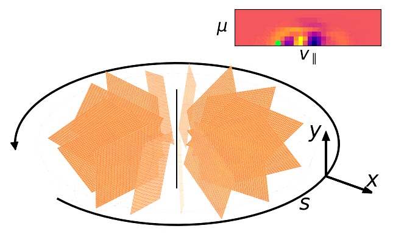
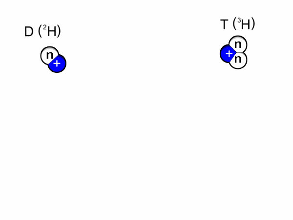
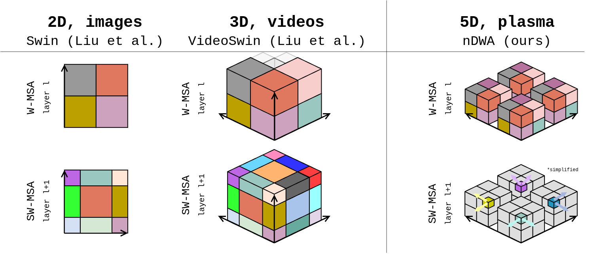
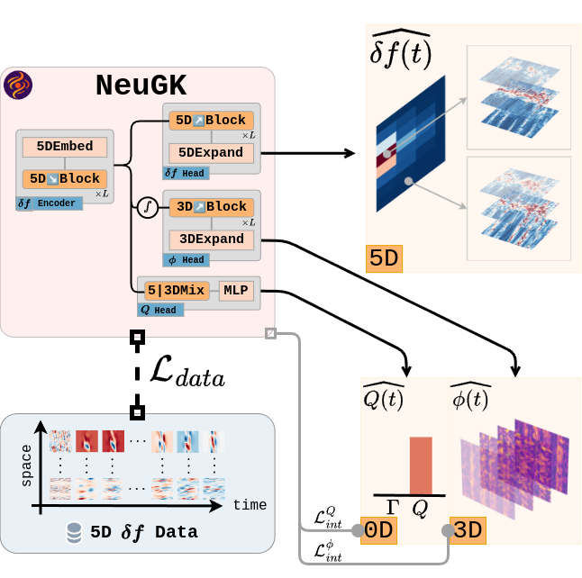
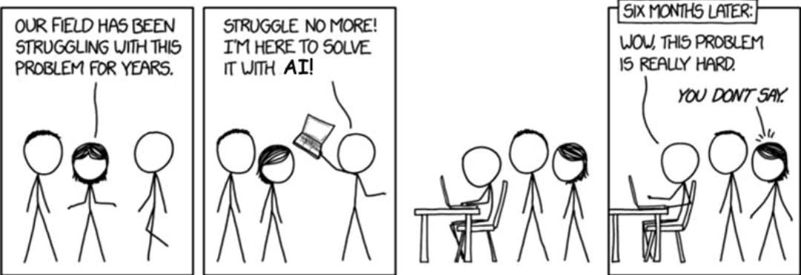

<div style="text-align: center;">
  <a href="https://github.com/ml-jku/neugk" target="_blank">
    
  </a>
  &nbsp;&nbsp;
  <a href="https://arxiv.org/abs/2502.07469" target="_blank">
    
  </a>
</div>

#  Efficiently Modeling 5D Plasma Turbulence Simulations


<figure style="text-align: center;">
    
    <figcaption style="color: white; font-size: 14px; margin-top: 8px;">
    Figure 1: Visualizing our modeled long-term predicted 5D distribution funciton, as 3D toruses within the 2D velocity space. 5D plotting has never been easier ;)
    </figcaption>
</figure>

## TL;DR
__Nuclear fusion is hard__, but understanding physical phenomena like plasma turbulence makes it slightly easier. One way to do this is with very expensive large scale gyrokinetics simulations. We propose  **NeuGK**, a neural surrogate model based on __swin transformers__ for nonlinear __gyrokinetic equations__, which models the turbulent transport directly in a __5D phase space__ (unlike existing methods which take reduced approaches) and offers a __>1000x speedup__ compared to numerical gyrokinetics solvers.

## Introduction

Nuclear fusion occurs when two light atoms (nuclei) merge to form a heavier atom (nucleus). During this process a small amount of mass is lost, releasing energy. This is the reaction that happens continuously inside stars and sustains their existance: for example, in the core of the Sun hydrogen atoms get fused to form helium, releasing energy that powers the Sun’s light and radiation, making life on Earth possible and sustainable.

In the context of human energy production, nuclear fusion is currently limited to more unstable hydrogen isotopes (Deuterium, Tritium) [[1](#ref-chen)]. This reaction produces a moderate amount of energy, with helium as a safe and neuter byproduct. 

<figure style="text-align: center;">
    
    <figcaption style="color: white; font-size: 14px; margin-top: 8px;">
    Figure 2: Animated deuterium-tritium nuclear fusion. Source: <a href="https://commons.wikimedia.org/wiki/File:Animated_D-T_fusion.gif">wikimedia.org</a>
    </figcaption>
</figure>

It is widely recognized that nuclear fusion is incredibly hard.

> _"Nuclear fusion is not rocket science, because it's way harder."_  
> — *Will*

However, because it promises near-infinite, safe, and relatively affordable energy source, it remains a key focus in the pursuit of securing our future energy supply.

In general, fusion only happens at extremely high temperatures and pressures (to overcome the repulsive forces between atoms). At these temperatures matter becomes **plasma**, which is inherently **turbulent** and must be confined to sustain the reaction [[1](#ref-chen), [2](#ref-freudenrich)]. With their mass, stars are able to use the gravitational field for confinement. However, on Earth we must rely on methods such as magnetic fields [[3](#ref-tokamaks)] or other forces [[4](#ref-inertial)].

## The Problem
Understanding **plasma turbulence** is crucial for modelling plasma scenarios for confinement control and reactor design. It is governed by the **nonlinear gyrokinetic equation**, which evolves a **5D distribution function** over time **in phase space**.


Let $f = f(x, y, s, v_{\parallel}, \mu)$ where:

- $x$, $y$ are spatial coordinates, in real space, cutting the torus radially.
- $s$ is the toroidal coordinate along the field line, going around the torus.
- $v_{\parallel} $ the parallel velocity component, tangential to the torus.
- $\mu$ is the magnetic angular moment, related to the gyrational velocity component.

The perturbed time-evolution of $f$ is governed by the gyrokinetic equation [[5](#ref-gyrokinetics), [6](#ref-gyrokinetics2), [7](#ref-gyrokinetics3)], a reduced form of the Vlasov-Maxwell PDE system

$$\frac{\partial f}{\partial t} + (v_\parallel \mathbf{b} + \mathbf{v}_D) \cdot \nabla f -\frac{\mu B}{m} \frac{\mathbf{B} \cdot \nabla B}{B^2} \frac{\partial f}{\partial v_\parallel} + \mathbf{v}_\chi \cdot \nabla f = S$$

Where:

- $v_{\parallel} \mathbf{b}$ is the motion along magnetic field lines.  
- $\mathbf{b} = \mathbf{B} / B$ is the unit vector along the magnetic field $\mathbf{B}$ with magnitude $ B $
- $\mathbf{v}_D $ is the magnetic drift due to gradients and curvature in $\mathbf{B}$
- $\mathbf{v}_\chi$ describes nonlinear drifts arising from crossing electric and magnetic fields.

The **nonlinear term** $\mathbf{v}_\chi \cdot \nabla f$ describes turbulent advection, and the resulting nonlinear coupling constitutes the computationally most expensive term.

For more details on gyrokinetics and the derivation of the equation, check _"The non-linear gyro-kinetic flux tube code gkw_" from _Arthur Peeters et al._ [[5](#ref-gyrokinetics)] and _"Gyrokinetics_" by _Xavier Gerbet and Maxime Lesur_ [[6](#ref-gyrokinetics3)].

---

<div style="border-left: 4px solid #c27721; background-color: #3b332b; padding: 12px 16px; margin: 1em 0; border-radius: 4px;">
    The probabilistic / phase-space view of evolving the distribution function over time is not the only way gyrokinetics can be phrased. Instead, it can also be described with charged particles, where gyrocenter trajectories are tracked directly. With this path-based approach, the distribution function can then be recovered from a large number of these gyro-paths (see particle-in-cell methods, [<a href="#ref-pic">8</a>]). <br><br>
    This duality is also related to the <strong>Fokker-Planck equation</strong> [<a href="#ref-fokker">9</a>], which describes the evolution of probability densities under drift and diffusion — analogous to how collisions are modeled in gyrokinetics. Both frames are physically equivalent, but offer different insights and numerical advantages.
</div>

[TODO I think the fokker plank connection sounds weird, maybe just probabilistic vs path-average? ]

Fully resolved gyrokinetics simulations are often prohibitively expensive and lead to practictioners relying on **reduced order models**, such as quasilinear models (for example QuaLiKiz [[10](#ref-qualikiz)]), which are fast but severely limited in generalization and accuracy.

---

## Our Approach

We start from the principle that **modeling the entire 5D distribution function directly is unavoidable** if the goal is to properly capture the physical phenomena. Moreover, challenges of runtime and memory requirements are amplified when dealing with this kind of high-dimensional data.

<strong> <span>&#8618;</span> <em>So, now what?</em> </strong> There is no architecture out there that can natively handle 5D inputs.

- **Convolutions?** There is no out-of-the-box convolution kernel for &gt;3D, so they need to be implemented either directly, recursively, or in a factorized manner. Regardless, convolutions become expensive and memory-intensive. [[11](#ref-cnn)]
- **Transformers?** ViTs can be applied to any number of dimension (provided proper patching / unpatching layers), but their quadratic scaling makes them unfeasible in our 5D setting. [[12](#ref-attention), [13](#ref-vit)]
- **Linear Attention?** Vision Transformers with linear attention such as the Shifted Window Transformer (swin) [[14](#ref-swin)] overcome quadratic scaling by performing attention locally in a simple way, making them an handy candidate for our case.

We generalize the local window attention mechanism, together with patching merging and unpatching layers, to n-dimensional inputs by generalizing the (patch and window) partitioning strategy used in these layers. Standalone implementation of the n-dimensional swin layers can be found [on github](https://github.com/gerkone/ndswin).


<figure style="text-align: center;">
    
    <figcaption style="color: white; font-size: 14px; margin-top: 8px;">
    Figure 3: Shifted window attention in the 2D (image), 3D (video), and 5D (our) case. In a layer, attention is performed locally only within components with the same color.
    </figcaption>
</figure>

We propose Neural Gyrokinetics,  **NeuGK**. We start from the popular UNet architecture [[15](#ref-unet)] and model the temporal evolution of the distribution function in an autoregressive manner. Accurate predictions of downstream integrated quantities are obtained by time-averaging.

Furthermore, NeuGK goes in the multitask direction by learning 5D distribution function, 3D potential and heat flux simultaneusly. This is achieved through three output branches at different dimensions that share latents with cross attention.

<figure style="text-align: center;">
    
    <figcaption style="color: white; font-size: 14px; margin-top: 8px;">
    Figure 4: NeuGK multitask trainin pipeline. We directly model the 5D distribution function of nonlinear gyrokinetics and incorporates 3D electrostatic potential fields and turbulent transport quantities, such as heat flux.
    </figcaption>
</figure>

## Results

> [TODO: Updated results table]

> [TODO: Diagnostics plots — zonal flow and spectra]

# Wrapping up

NeuGK can outperform other approaches and machine learning baselines in modelling plasma turbulence, it accurately captures nonlinear phenomena self-consistently, while offering a three order of magnitude speedup compared to the numerical solver GKW [[7](#ref-gyrokinetics3)]. The capability to directly evolve the 5-dimensional phase space, and all the diagnostics and non-linear phenomena studies that originate from it were not present in any prior surrogate or reduced numerical model.
As a result, NeuGK offers a fruitful alternative to efficient approximation of turbulent transport.

However, the autoregressive nature of it means that it is still expensive to run compared to other reduced approaches, and most importantly because errors accumulate long term predictions are sometimes problematic and unreliable.

TODO do we already mention diffusion?

<figure style="text-align: center;">
    
    <figcaption style="color: white; font-size: 14px; margin-top: 8px;">
    xkcd: 1831
    </figcaption>
</figure>

## Cite
```
@misc{galletti20255dneuralsurrogatesnonlinear,
      title={5D Neural Surrogates for Nonlinear Gyrokinetic Simulations of Plasma Turbulence}, 
      author={Gianluca Galletti and Fabian Paischer and Paul Setinek and William Hornsby and Lorenzo Zanisi and Naomi Carey and Stanislas Pamela and Johannes Brandstetter},
      year={2025},
      eprint={2502.07469},
      archivePrefix={arXiv},
      primaryClass={physics.plasm-ph},
      url={https://arxiv.org/abs/2502.07469}, 
}
```

## References
<a name="ref-chen"></a>
[1] Francis F. Chen, *Introduction to Plasma Physics and Controlled Fusion*, 3rd ed., Springer, 2016.

<a name="ref-freudenrich"></a>
[2] Craig Freudenrich, "Physics of Nuclear Fusion Reactions," *HowStuffWorks*, Aug. 4, 2015. [Online]. Available: [http://science.howstuffworks.com/fusion-reactor1.html](http://science.howstuffworks.com/fusion-reactor1.html)

<a name="ref-tokamaks"></a>
[3] J. Wesson, *Tokamaks*, 4th ed., Oxford University Press, 2011. 

<a name="ref-inertial"></a>
[4] S. Atzeni and J. Meyer-ter-Vehn, *The Physics of Inertial Fusion: Beam Plasma Interaction, Hydrodynamics, Hot Dense Matter*, Oxford University Press, 2004.

<a name="ref-gyrokinetics"></a>
[5] A. G. Peeters et al., *The non-linear gyro-kinetic flux tube code GKW*, Computer Physics Communications, 180(12), 2650–2672, 2009.

<a name="ref-gyrokinetics2"></a>
[6] E. A. Frieman and L. Chen, “Nonlinear gyrokinetic equations for low-frequency electromagnetic waves in general plasma equilibria,” *Phys. Fluids*, vol. 25, no. 3, pp. 502–508, Mar. 1982.

<a name="ref-gyrokinetics3"></a>
[7] X. Garbet and M. Lesur, *Gyrokinetics*, Lecture notes, France, Feb. 2023. [Online]. Available: https://hal.science/hal-03974985

<a name="ref-pic"></a>
[8] C. K. Birdsall and A. B. Langdon, *Plasma Physics via Computer Simulation*, Taylor & Francis, 2004.

<a name="ref-fokker-planck"></a>
[9] H. Risken, *The Fokker-Planck Equation: Methods of Solution and Applications*, 2nd ed., Springer, 1989.

<a name="ref-qualikiz"></a>
[10] A. Casati, J. Citrin, C. Bourdelle, et al., "QuaLiKiz: A fast quasilinear gyrokinetic transport model," *Computer Physics Communications*, vol. 254, p. 107295, 2020.

<a name="ref-cnn"></a>
[11] Y. LeCun, Y. Bengio, and G. Hinton, "Deep learning," *Nature*, vol. 521, pp. 436–444, 2015.

<a name="ref-attention"></a>
[12] A. Vaswani, N. Shazeer, N. Parmar, et al., "Attention Is All You Need," in *Advances in Neural Information Processing Systems (NeurIPS)*, 2017.

<a name="ref-vit"></a>
[13] A. Dosovitskiy, L. Beyer, A. Kolesnikov, et al., "An Image is Worth 16x16 Words: Transformers for Image Recognition at Scale," in *International Conference on Learning Representations (ICLR)*, 2021.

<a name="ref-swin"></a>
[14] Z. Liu, Y. Lin, Y. Cao, et al., "Swin Transformer: Hierarchical Vision Transformer using Shifted Windows," in *Proceedings of the IEEE/CVF International Conference on Computer Vision (ICCV)*, 2021, pp. 10012–10022.

<a name="ref-unet"></a>
[15] O. Ronneberger, P. Fischer, and T. Brox, "U-Net: Convolutional Networks for Biomedical Image Segmentation," in *Medical Image Computing and Computer-Assisted Intervention (MICCAI)*, 2015, pp. 234–241.