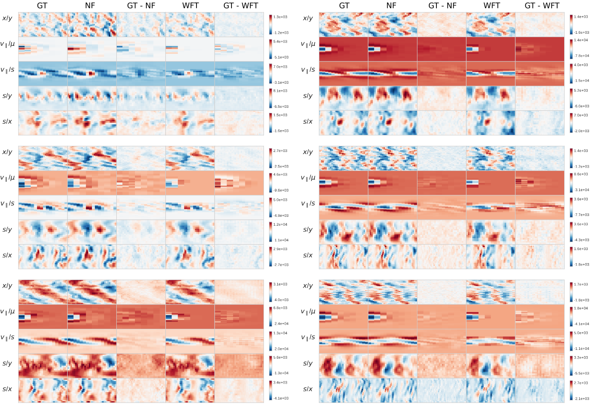
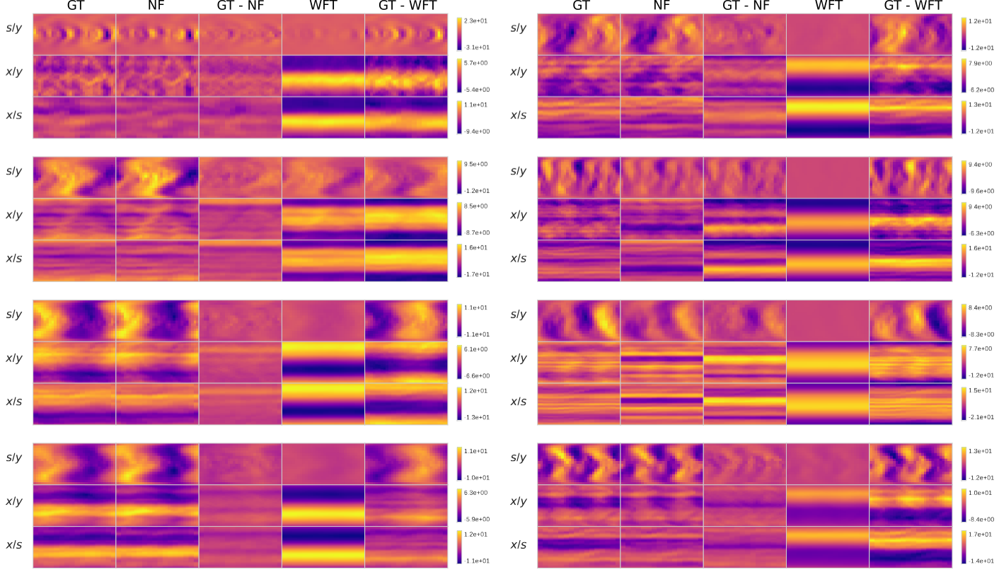
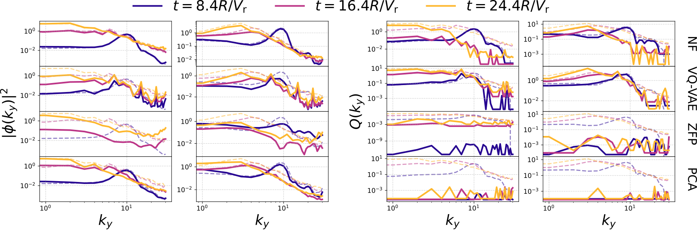
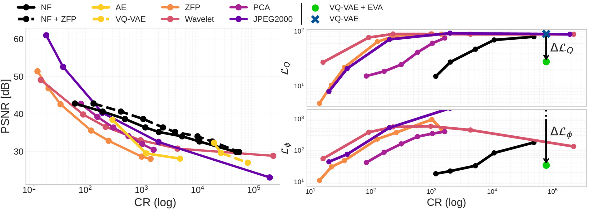

<div style="text-align: center;">
  <a href="https://github.com/ml-jku/neural-gyrokinetics" target="_blank">
    
  </a>
  &nbsp;&nbsp;
  <a href="TODO" target="_blank">
    
  </a>
</div>

---

## TL;DR
<div style="border-left: 4px solid #5e4931ff; background-color: #e8cfcfff; padding: 12px 16px; margin: 1em 0; border-radius: 4px;">

<strong>Modern scientific simulations produce massive amounts of data</strong>.
Storing and analyzing this data has become a bottleneck, forcing researchers to throw away valuable information and limiting machine learning training to reduced settings or limited amounts of data. Plasma turbulence modeled by the gyrokinetic equation is a clear instance of this pattern.
We introduce  <strong>Physics-Inspired Neural Compression (PINC)</strong> for plasma turbulence. We explore various learned compression techniques, like Neural Fields and VQ-VAEs, and train them with novel plasma-specific physics-informed losses, achieving <strong>70,000x</strong> size reduction while maintaining key physical characteristics.
Our evaluation pipeline assesses spatial reconstruction quality, preservation <strong>noninear integrals</strong>, and the fidelity of <strong>transient dynamics</strong> essential for turbulence.

</div>

## Introduction
In the [previous blogpost](https://ml-jku.github.io/blog/2025/gyroswin/) we introduced  <strong>GyroSwin</strong> [[1](#ref-gyroswin)], a scalable 5D vision transformer able to reliably capture the full nonlinear dynamics of gyrokinetic plasma turbulence.

In this post, we present a direction orthogonal to GyroSwin, tackling one of the main challenges that transpired from large-scale training on high-dimensional data: __storage!__

Indeed, to achieve its impressive results GyroSwin was trained on a "simple" dataset that consisted already of __terabytes of plasma data__. "Production" gyrokinetic simulations are orders of magnitude more expensive, both in terms of compute and storage required. From a machine learning perspective this would make it unfeasible to package a complete and diverse gyrokinetic dataset.
On the _plasma scientist_ side of the coin, entire simulations can never be stored at full resolution, and practictioners base their analysis on simpler integrated quantities, time traces and spectras.

Our attempt to ease both concerns is  <strong>Physics-Inspired Neural Compression (PINC)</strong>: we explore __neural compression__ models (neural implicit fields [[2](#ref-nerf)] and Vector Quantized VAEs [[3](#ref-vqvae)]) equipped with plasma-specific __physics-informed losses__ [[4](#ref-pinn)], and achieve impressive results in terms of reconstruction quality, physics preservation and compression rates (with VQ-VAEs, up to __70,000x__!).


## Our Approach
<figure style="text-align: center;">
    
    <figcaption style="color: black; font-family: monospace; font-size: 14px; margin-top: 8px;">
    Figure 1: Sketch of the training and evaluation for PINC models. Training is done at individual time snapshots for scalability, while evaluation considers turbulence characteristics, taking both spatial and temporal information into account.
    </figcaption>
</figure>


### Evaluating Plasma Turbulence
As described in the previous blogpost, the full representation of gyrokinetics is the 5D phase space distribution function $\bm{f}$.
To check whether compression keeps the physics intact, we look at both _spatial_ and _temporal_ measures of turbulence.
Two core quantities come from integrating $\bm{f}$ to obtain the **electrostatic potential** $\bm{\phi}$ and **heat flux** $Q$:

$$
\bm{\phi} = \mathbf{A} \int \mathbf{J_{0}} \mathbf{f} , \mathrm{d}v_{\parallel}\mathrm{d}\mu,
\quad
Q = \int \mathbf{B} \int \mathbf{v}^2 \mathbf{\phi f} , \mathrm{d}v_{\parallel}\mathrm{d}\mu,\mathrm{d}x\mathrm{d}y\mathrm{d}s.
$$

Additionally, turbulence is interpreted by looking at how energy distributes across spatial modes, using wave-space diagnostics like $k_y^{\text{spec}}$ and $Q^{\text{spec}}$.

### Neural Compression
We experiment with two dominant techniques:
_ __Autoencoders (AEs / VQ-VAEs):__ explicit compression through a latent bottleneck, __parameters are shared across data__.
_ __Neural Implicit Fields (NFs):__ store each snapshot as an tiny __independent__ coordinate-based network, with compression happening implicitly in weight space.

Both optimize a complex MSE loss on the 5D distribution $\bm{f}$

$$
\mathcal{L}_{\text{recon}} =
\sum \left| \Re(\mathbf{f}_{\text{pred}} - \mathbf{f}_{\text{GT}})^2 +
\Im(\mathbf{f}_{\text{pred}} - \mathbf{f}_{\text{GT}})^2 \right|.
$$


### Physics-Inspired Neural Compression
Plain reconstruction loss isn’t enough, and high reconstruction quality does not always reflect in the physical fidelity.
PINC adds penalties on the ground truth physical quantities $\bm{\phi}$ and $Q$, as well as the diagnostic spectras $k_y^{\text{spec}}$ and $Q^{\text{spec}}$.
Moreover, monotonicity of the energy cascade is enforced as a knowledge-driven physical constraint.

As a side note, while PINC-neural fields can be confortably trained with _off-the-shelf_ optimizers, the story is different for the more complex autoencoders. 
Instead, naively training them on all PINC losses often leads to severe instabilities and catastrophic forgetting. We solve this complication by pretraining the larger autoencoders on the distribution $\bm{f}$, and subsequently using Explained Variance Adaptation [[5](#ref-eva)] to finetune the model on the PINC losses.


## Results
### Quantitative
TODO final table
### Qualitative
<div style="display:flex; justify-content:center; gap:12px; align-items:flex-start; flex-wrap:wrap;">
  <figure style="margin:0; text-align:center; width:45%;">
    
    <figcaption style="color:black; font-size:13px;">
      (a) <strong>f</strong>
    </figcaption>
  </figure>

  <figure style="margin:0; text-align:center; width:45%;">
    
    <figcaption style="color:black; font-size:13px;">
      (b) <strong>ϕ</strong>
    </figcaption>
  </figure>
  <p style="text-align: center; color: black; font-family: monospace; font-size:14px;">
  Figure 2: Reconstructions for the density (a) and electrostatic potential (b) for a few randomly picked snapshots across different trajectories.
  </p>
</div>

These 2D projections of the 5D (left) and 3D (right) fields demonstrate the advantage of PINC neural fields in direct density reconstruction, end even more clear for integral fidelity for the electrostatic potential. This is reflected in the higher $\bm{\phi}$ PSNR in Table 1.

<figure style="text-align: center;">
    
    <figcaption style="color: black; font-family: monospace; font-size: 14px; margin-top: 8px;">
    Figure 3: Potential (ky) and flux spectra at three timesteps, sampled in the transitional phase where mode growth and energy cascade happens. LogLog plot.
    </figcaption>
</figure>

Figure 3 visualizes the __bi-directional energy cascade__ phenomena: as turbulence develops, energy is transfered from higher to lower modes and vice-versa.
Columns are different trajectories, rows are compression methods, lines of varied colors are the $k_y^{\text{spec}}$ and $Q^{\text{spec}}$ at specific timesteps, and transparent dashed lines are respective ground truth.

While traditional compresson techniques sometimes manage to visually capture $k_y^{\text{spec}}$, they fail completely on $Q^{\text{spec}}$. On the other hand, PINCs are somewhat less accurate on high frequencies, but generally capture low frequencies and magnitude pretty well.


### Rate-Distortion scaling
<figure style="text-align: center;">
    
    <figcaption style="color: black; font-family: monospace; font-size: 14px; margin-top: 8px;">
    Figure 4: Rate-Distortion scaling for direct density <strong>f</strong> reconstruction (left) and potential <strong>ϕ</strong> and heat flux Q integrals (right).
    </figcaption>
</figure>

The left figure highlights an advantageous exponential scaling for the neural fields, agains a super-exponential decay for traditional compression techniques. A _"goldilocks compression rate"_ from 200x to 10,000x can be also recovered, where neural fields outperform traditional compression on direct reconstruction.

The left plot shows the improvement of PINC training in terms of the integral loss gap, reported for a single VQ-VAE (blue cross $\to$ green dot, $\Delta \mathcal{L}$ gap displayed with an arrow).

## Conclusions and Future Work
PINC opens new possibilities for sharing, storing, and analyzing scientific datasets that was previously too large to handle.

<strong> <span>&#8618;</span> </strong> So, what's next?

1. __Big small datasets.__ The initial concern that motivated this work is scaling GyroSwin to even larger data volumes, and especially higher fidelity data. With PINC, compressed representations can either be inflated _in-transit_, or directly serve as a dataset for _"compressed"_ surrogate modeling. For instance, the VQ-VAE can be leveraged for latent diffusion, where turbulent solutions are generated starting from operational parameters. 
2. **Integration into numerical codes and workflows.** Integrating PINC in the plasma scientist workflow of GKW would enable cheap, staggered **on-the-fly (in-situ)** compression during the simulation, making it feasible to capture transient dynamics without writing massive data dumps to disk.


## Resources

 - <a href="TODO">Paper</a>
 - <a href="https://ml-jku.github.io/blog/2025/gyroswin/">GyroSwin Blogpost</a>
 - <a href="https://github.com/ml-jku/neural-gyrokinetics">Code</a>

## Citation

If you found our work useful, please consider citing it.

```


```

## References
<a name="ref-gyroswin"></a>
[1] Fabian Paischer, Gianluca Galletti, William Hornsby, Paul Setinek, Lorenzo Zanisi, Naomi Carey, Stanislas Pamela, and Johannes Brandstetter, *“GyroSwin: 5D Surrogates for Gyrokinetic Plasma Turbulence Simulations”* in *Advances in Neural Information Processing Systems 38 (NeurIPS 2025)* [https://arxiv.org/abs/2510.07314](https://arxiv.org/abs/2510.07314)

<a name="ref-nerf"></a>
[2] Ben Mildenhall, Pratul P. Srinivasan, Matthew Tancik, Jonathan T. Barron, Ravi Ramamoorthi, and Ren Ng, *“NeRF: Representing Scenes as Neural Radiance Fields for View Synthesis,”* arXiv preprint arXiv:2003.08934, 2020. [Online]. Available: [https://arxiv.org/abs/2003.08934](https://arxiv.org/abs/2003.08934)

<a name="ref-vqvae"></a>
[3] Aaron van den Oord, Oriol Vinyals, and Koray Kavukcuoglu, *“Neural Discrete Representation Learning,”* arXiv preprint arXiv:1711.00937, 2018. [Online]. Available: [https://arxiv.org/abs/1711.00937](https://arxiv.org/abs/1711.00937)

<a name="ref-pinn"></a>
[4] George E. Karniadakis, Ioannis G. Kevrekidis, Lu Lu, et al., *“Physics-informed machine learning,”* *Nature Reviews Physics*, vol. 3, pp. 422–440, 2021. [Online]. Available: [https://doi.org/10.1038/s42254-021-00314-5](https://doi.org/10.1038/s42254-021-00314-5)

<a name="ref-eva"></a>
[5] Fabian Paischer, Lukas Hauzenberger, Thomas Schmied, Benedikt Alkin, Marc Peter Deisenroth, and Sepp Hochreiter, *“Parameter Efficient Fine-tuning via Explained Variance Adaptation,”* arXiv preprint arXiv:2410.07170, in *Advances in Neural Information Processing Systems 38 (NeurIPS 2025)* [https://arxiv.org/abs/2410.07170](https://arxiv.org/abs/2410.07170)


---
2025, Gianluca Galletti